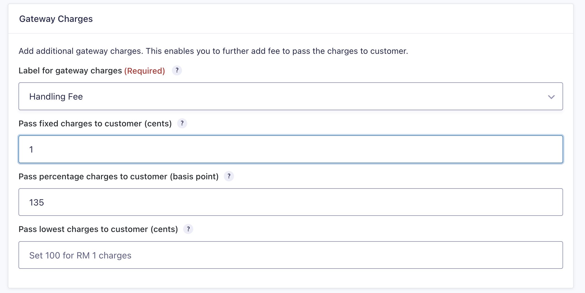
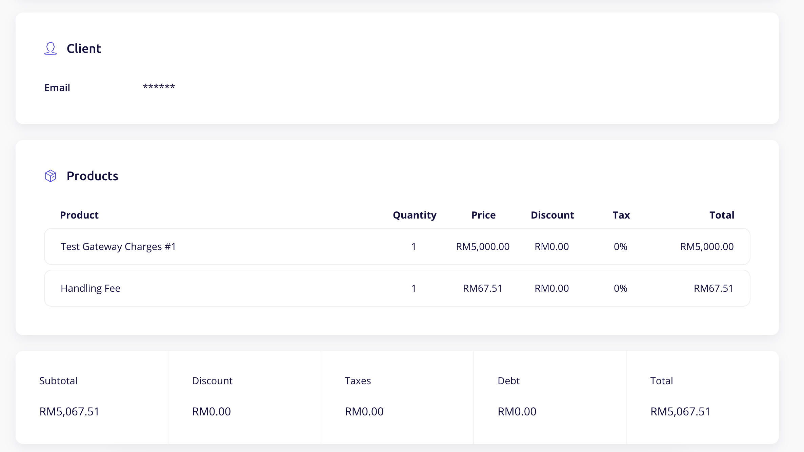

# CGF Gateway Charges

This module adds Gateway Charges features to CHIP for Gravity Forms. It requires installation of Gravity Forms plugin and CHIP for Gravity Forms plugin.

## Installation

* [Download zip file of Gravity Forms plugin.](https://github.com/CHIPAsia/cgf-gateway-charges/archive/refs/heads/main.zip)
* Log in to your Wordpress admin panel and go: **Plugins** -> **Add New**
* Select **Upload Plugin**, choose zip file you downloaded in step 1 and press **Install Now**
* Activate plugin

## Screenshot

Screenshot 1: Gateway charges configuration page

Screenshot 2: Invoice page stating gateway charges

## Other

Facebook: [Merchants & DEV Community](https://www.facebook.com/groups/3210496372558088)
